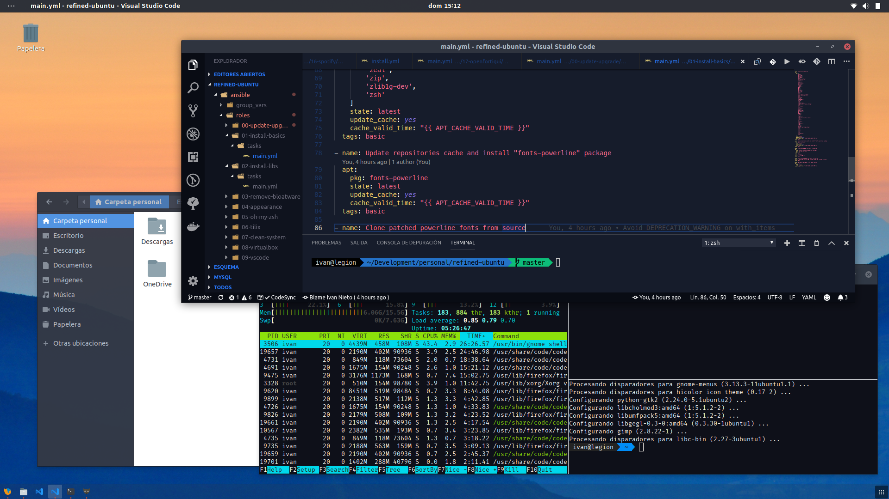

# Refined Ubuntu

Install and configure a custom Ubuntu 18.04 LTS version using Ansible.



- Upgrade
- Clean system from bloatware
- Configure appearance
- Configure apps
- Install development tools and utils

## Requirements

- Fresh installation of Ubuntu 18.04 LTS
- Python2.7

## Install

```bash
./INSTALL.sh
```

### IMPORTANT: You will be prompted for some configuration steps

## This is what the installer does

- 00 - Update and Upgrade System
- 01 - Install basic programs
- 02 - Install libs
- 03 - Remove Bloatware
- 04 - Set appearance
- 05 - Install and Configure Oh My Zsh
- 06 - Install and Configure Tilix
- 07 - Clean and Configure System
- 08 - Install Virtualbox
- 09 - Install and Configure Microsoft VSCode
- 10 - Install Google Chrome
- 11 - Install and Configure git
- 12 - Install Java
- 13 - Install Docker and Docker Compose
- 14 - Install and Configure MySQL
- 15 - Install and Configure OpenSSH Server
- 16 - Install Spotify
- 17 - Install OpenFortiGUI VPN
- 18 - Install Miniconda3 (Role by: [Andrew Rothstein](https://galaxy.ansible.com/andrewrothstein/miniconda))

